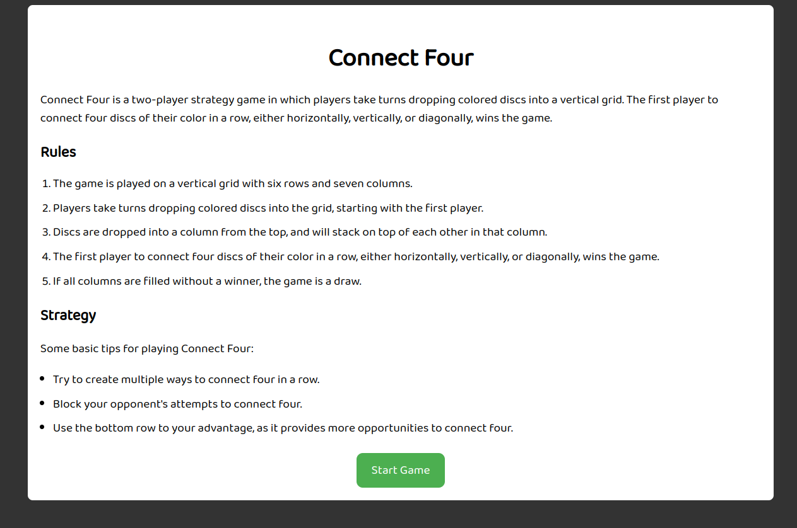
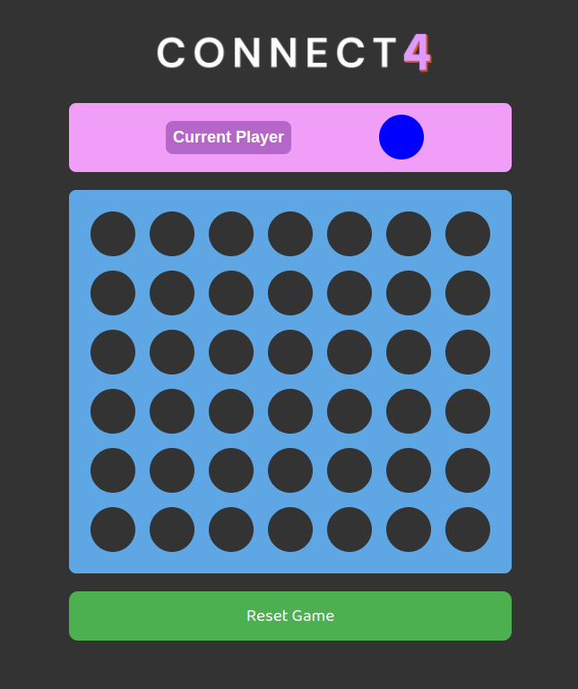
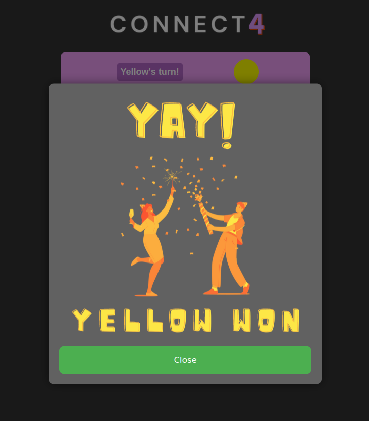

# **Connect 4**

## General Overview

Connect Four is a two-player strategy game in which players take turns dropping colored discs into a vertical grid. The first player to connect four discs of their color in a row, either horizontally, vertically, or diagonally, wins the game.

## Rules

1.  The game is played on a vertical grid with six rows and seven columns.
2.  Players take turns dropping colored discs into the grid, starting with the first player.
3.  Discs are dropped into a column from the top, and will stack on top of each other in that column.
4.  The first player to connect four discs of their color in a row, either horizontally, vertically, or diagonally, wins the game.
5.  If all columns are filled without a winner, the game is a draw.

## Strategy

Some basic tips for playing Connect Four:

- Try to create multiple ways to connect four in a row.
- Block your opponent's attempts to connect four.
- Use the bottom row to your advantage, as it provides more opportunities to connect four.

## Screenshots

## Technologies Used

- HTML
- CSS
- JavaScript

## Play the Game

The game can be accessed [here](https://lehitutoring.github.io/connect-four/). It requires two players. Remember, blue always goes first. When the game concludes, an overlay appears on screen indicating the game is over. To reset, click close on the overlay and press reset.

## Future Work

- **A working CPU**: The original plan for the game included the option of facing an AI (CPU). However, due to time constraints, this was not possible. 
- **SocketIO**: This current version of Connect Four implements two player gameplay so long as the two people are sharing a single machine. The hope is to one day expand this game to allow for remote gameplay. One day, two people from a distance away will be able to play my version of Connect Four.
- **UI Enhancement**: This is a given but the hope is to include animations as the current implementation of the game does not have chips falling into place. I'd also like to further develop the styling of my application. It is a functional game, but these UI enhancements will further the experience of those playing my version of the classic connect four.
